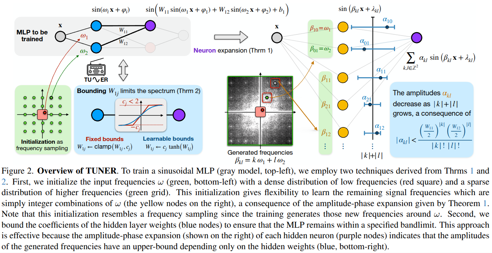

# Tuning the Frequencies: Robust Training for Sinusoidal Neural Networks

<a href="https://sites.google.com/site/tiagonovellodebrito">Tiago Novello</a><sup>1, 2*</sup>,
<a href="https://scholar.google.com/citations?user=UBfNGnMAAAAJ&hl=en&oi=ao">Diana Aldana</a><sup>1*</sup>,
<a href="https://andrefaraujo.github.io/">Andre Araujo</a><sup>2</sup>,
<a href="https://lvelho.impa.br/">Luiz Velho</a><sup>1</sup>

<sup>1</sup>IMPA, <sup>2</sup>Google DeepMind
<br>
<sup>*</sup> denotes equal contribution

Official pytorch implementation of "Tuning the Frequencies: Robust Training for 
Sinusoidal Neural Networks", highlighted paper of CVPR 2025. 



<div style="text-align: center; font-size: 30px;">
<a href="https://DianaPat.github.io/TUNER/">Page</a> | <a href="docs/assets/Novello_Tuning_the_Frequencies_Robust_Training_for_Sinusoidal_Neural_Networks_CVPR_2025_paper.pdf">Paper</a>
</div>

## Getting started
The implementation below considers that the user is familiarized with either [SIREN](https://www.vincentsitzmann.com/siren/) or [MR-Net](https://www.sciencedirect.com/science/article/pii/S0097849323000699) repository.


### Code organization
The code is organized as follows:

* `ablations`: Some of the scripts used to run experiments of the main paper
* `configs`: Contains the config file that sets the hyperparameters used to train the scripts
* `data`: Datasets used to test and train the models.
* `networks`: Scripts with the classes for the two architectures of SIREN and MRNet
* `training`: Scripts to train MRNet, methods to log the results

### Setup and sample run

1. Open a terminal (or Git Bash if using Windows)
2. Clone the repository: `git clone https://github.com/DianaPat/taming.git`.
3. Enter project folder: `cd tuner`.
4. Create the environment and setup project dependencies
5. Download the kodak datasets (available [here](https://r0k.us/graphics/kodak/)) and extract them into the `data` folder of the repository
6. Train a network for the two macaws mesh:
```
python train_siren.py
```
7. If the `logger` is set as `local`, the results will be logged in
`runs/logs`, stored in a folder with a date ordering prefix and in another
folder with the hour as prefix.

## Contact
If you have any questions, please feel free to email the authors, or open an issue.
